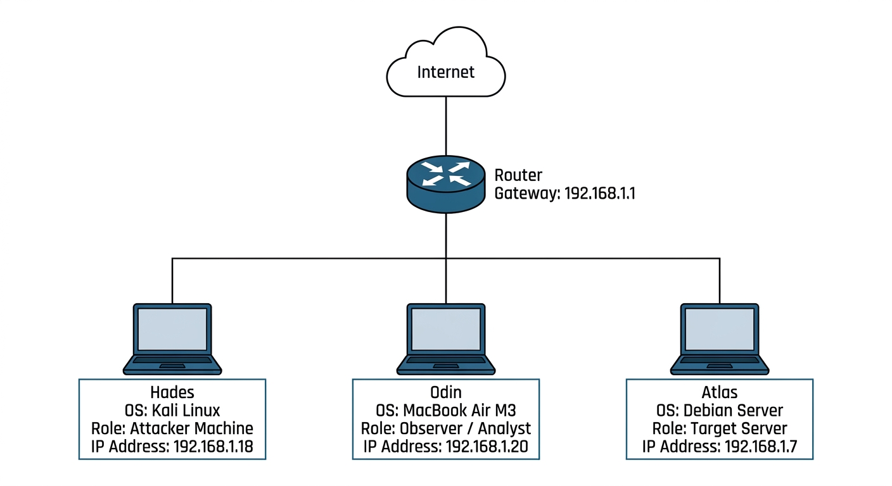

# Cybersecurity-home-lab

# Overview
This project documents the design and implementation of a physical three-machine cybersecurity laboratory built to simulate a small enterprise environment.

**Why Physical Machines?**

Many cybersecurity home labs are implemented entirely within virtual machines on a single host. While virtualized labs are excellent learning environments, I chose to build this lab using three dedicated physical systems to gain hands-on experience with real networking, device configuration, and host-to-host communication.
Using separate machines allowed me to:

- Configure networking between independent hosts
- Practice secure remote administration using SSH
- Observe real network traffic between systems
- Simulate attacker, target, and observer roles
- Gain experience managing multiple operating systems simultaneously

This lab uses three dedicated physical systems with distinct operational roles:

 **Odin**    -    Observer and monitoring macOS workstation
 
 **Atlas**   -    Debian Linux target server
 
 **Hades**   -    Kali Linux attacker machine

# Lab Architecture

# Objectives

- Design a segmented cybersecurity lab

- Configure secure SSH access using public key authentication
  
- Perform network reconnaissance

- Assess exposed services
  
- Harden Linux services
  
- Simulate common attacks
  
- Observe network traffic
  
- Document findings and mitigations

### Networking

- TCP/IP
- Static IPv4 Addressing
- SSH
- ED25519 Public Key Authentication

### Security Tools

- OpenSSH
- Nmap
- Hydra
- Wireshark
- UFW
- Fail2Ban

*(More tools will be added as the project progresses.)*

## Skills Demonstrated

This project demonstrates practical experience with:

- Linux Administration
- Network Configuration
- SSH Hardening
- Public Key Authentication
- Network Reconnaissance
- Vulnerability Assessment
- Password Auditing
- Network Traffic Analysis
- Security Documentation
- Incident Reporting

# Project Phases
| [01 - Network Configuration](docs/01-network-configuration.md)               | ⏳ |

| [02-SSH-Configuration-and-public-key-authentication.md](docs/02-SSH-Configuration-and-public-key-authentication.md) | ⏳ |

| [03 - Network Reconnaissance](docs/03-network-reconnaissance.md)             | ⏳ |

| [04 - Vulnerability Assessment](docs/04-vulnerability-assessment.md)         | ⏳ |

| [05 - Linux Hardening](docs/05-linux-hardening.md)                           | ⏳ |

| [06 - Password Auditing](docs/06-password-auditing.md)                       | ⏳ |

| [07 - Network Traffic Analysis](docs/07-network-traffic-analysis.md)         | ⏳ |

| [08 - Incident Report](docs/08-incident-report.md)                           | ⏳ |
