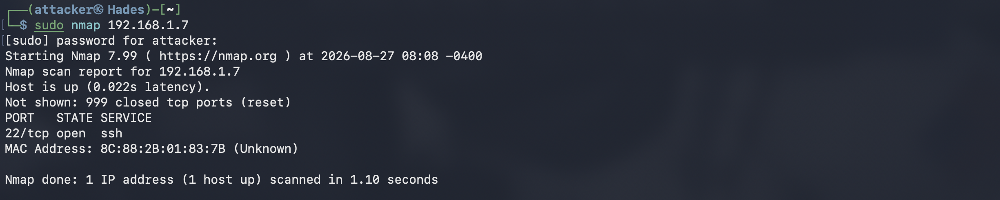

# Phase 3 - Network Discovery & Reconnaissance

## Summary

This phase uses the Hades attacker machine to perform network discovery and reconnaissance against the cybersecurity laboratory environment.

The objective is to identify active hosts, determine which network services are exposed, and collect information about the software providing those services.

This establishes an initial view of the laboratory's attack surface before proceeding to vulnerability assessment and system hardening.

All reconnaissance activities in this phase were performed against systems belonging to the home laboratory.

---

## Objective

The objectives of this phase are to:

- Identify the local network and subnet.
- Discover active hosts on the network.
- Identify open TCP ports on laboratory systems.
- Determine which services are running on exposed ports.
- Identify service and software versions where possible.
- Establish a baseline of the laboratory's exposed attack surface.

---

## Rationale

Before assessing or attacking a system, a security analyst must first understand what exists on the network.

Network reconnaissance provides information about:

1. Which hosts are reachable.
2. Which ports are exposed.
3. Which services are accessible.
4. Which software versions are running.
5. Which systems may require further investigation.

This information establishes the attack surface of the environment and provides a foundation for subsequent vulnerability assessment.

The reconnaissance was performed from Hades rather than relying entirely on the known IP addresses configured during previous phases. This simulates the perspective of an attacker or security analyst who must first discover the environment before assessing it.

---

## Tools

### Nmap

[Nmap](https://nmap.org/) was used as the primary network reconnaissance tool.

Nmap can perform host discovery, port scanning, service detection, and operating system detection.

In this phase, Nmap was primarily used to:

- Discover active hosts.
- Identify open TCP ports.
- Identify network services.
- Detect service and software versions.

---

# Implementation

## 1. Identify the Local Network

Before performing network reconnaissance, the network configuration of Hades was examined.

```bash
ip addr
```


Why?

The `ip addr` command displays the network interfaces and their assigned IP addresses.

This allows the active network interface and IPv4 address assigned to Hades to be identified.

Hades was configured with:
``` bash
192.168.1.18/24
```
The /24 prefix indicates that Hades belongs to the: `192.168.1.0/24` network.

The routing table was then examined:
``` bash
ip route
```


Why?

The ip route command displays the routes known to the operating system.

This was used to confirm the local subnet and identify the default gateway used by Hades.

# 2. Host Discovery

Nmap was used to discover active hosts on the local subnet:
``` bash
sudo nmap -sn 192.168.1.0/24
```
Why?

The -sn option performs host discovery without performing a port scan.

This allows the attacker machine to determine which hosts are currently reachable on the network before examining their individual services. This process is faster than scanning all the ports and avoids unnecessary delays in host discovery.

Results

The scan identified the laboratory hosts, including:


Other devices belonging to the home network may also have appeared during host discovery.

These devices were not included in the detailed assessment because they are outside the scope of this laboratory.

# 3.Initial Port Scan

After identifying Atlas as the target system, a basic Nmap scan was performed:
``` bash
sudo nmap 192.168.1.7
```
Why?

This performs a basic scan of Nmap's commonly scanned TCP ports.

The purpose was to establish an initial understanding of which services were exposed by Atlas.

## Results
The scan identified the following open ports:


## Interpretation

An open port indicates that a service is listening for network connections.

An open port does not automatically indicate a vulnerability.

For example:
`22/tcp open ssh` indicates that an SSH service is accessible, but further investigation is required to determine whether the service is securely configured and whether it contains any known vulnerabilities.

# 4. Services and Version Detection
After identifying the open ports, Nmap was used to determine which services and software versions were associated with those ports:
``` bash
sudo nmap -sV 192.168.1.7
```
Why?

The `-sV` option enables service and version detection.
This provides additional information about the software listening on discovered ports.

## Results

The scan identified the following services:


## Interpretation

Service and version information provides useful context for subsequent vulnerability assessment.

For example, identifying a specific OpenSSH version allows that software version to be investigated for known vulnerabilities and security advisories.

However, the presence of a particular software version does not by itself establish that the system is vulnerable.

Further assessment is required.


## Security Considerations

Reconnaissance results should not automatically be interpreted as evidence of a vulnerability.

An exposed service may be intentional and properly secured.
A security analyst must therefore distinguish between:

- An exposed service
- A misconfigured service
- An outdated service
- A vulnerable service

These are related but distinct findings.

## Lessons Learned

This phase demonstrated the importance of reconnaissance as the foundation of a security assessment.

Key lessons learned include:

- Network reconnaissance should begin by understanding the network scope.
- Host discovery identifies systems before individual services are examined.
- Open ports reveal the network-accessible attack surface.
- Service detection provides additional information about exposed services.
- A service being exposed does not necessarily mean that it is vulnerable.
- Full port scans can identify services operating on uncommon ports.
- Service and version information can provide useful context for vulnerability assessment.
- Reconnaissance results should be documented as evidence rather than treated as assumptions.

Most importantly, this phase demonstrated the difference between discovering an attack surface and determining whether that attack surface is vulnerable.

## Conclusion

Network reconnaissance successfully established a baseline of the laboratory environment from the perspective of the Hades attacker machine.

The process identified active hosts, exposed ports, and network services that can now be investigated during the vulnerability assessment phase.

The results from this phase will be used to determine which services require further investigation and which security controls should be applied during later hardening activities.
