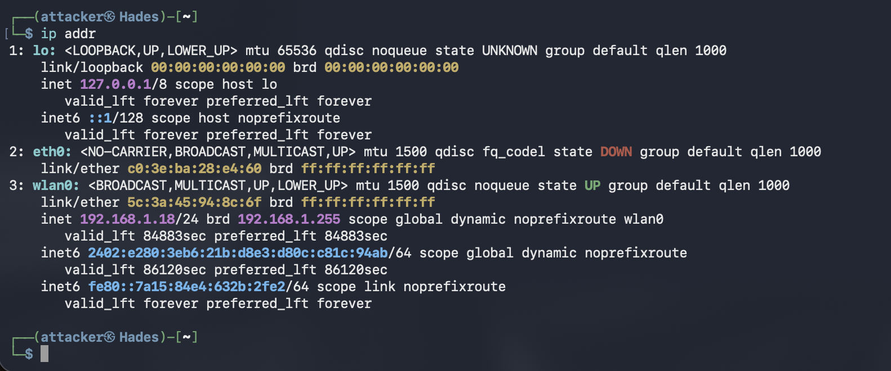
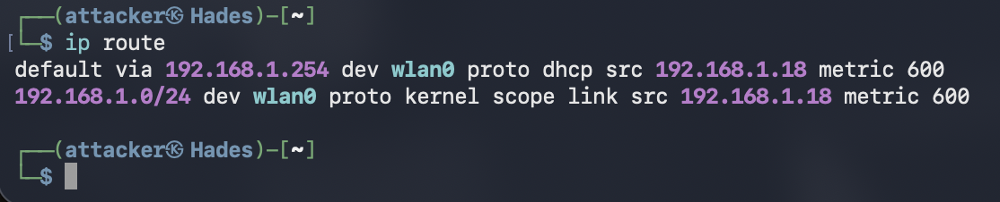
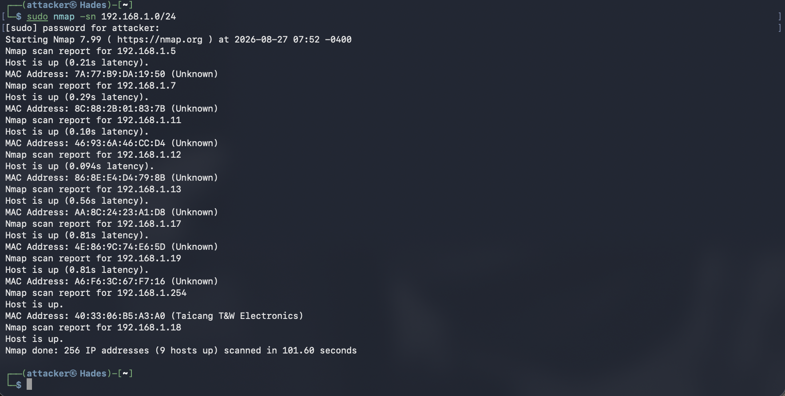

# Phase 3 - Network Discovery & Reconnaissance

## Summary

This phase uses the Hades attacker machine to perform network discovery and reconnaissance against the cybersecurity laboratory environment.

The objective is to identify active hosts, determine which network services are exposed, and collect information about the software providing those services.

This establishes an initial view of the laboratory's attack surface before proceeding to vulnerability assessment and system hardening.

All reconnaissance activities in this phase were performed against systems belonging to the home laboratory.

---

## Objective

The objectives of this phase are to:

- Identify the local network and subnet.
- Discover active hosts on the network.
- Identify open TCP ports on laboratory systems.
- Determine which services are running on exposed ports.
- Identify service and software versions where possible.
- Establish a baseline of the laboratory's exposed attack surface.

---

## Rationale

Before assessing or attacking a system, a security analyst must first understand what exists on the network.

Network reconnaissance provides information about:

1. Which hosts are reachable.
2. Which ports are exposed.
3. Which services are accessible.
4. Which software versions are running.
5. Which systems may require further investigation.

This information establishes the attack surface of the environment and provides a foundation for subsequent vulnerability assessment.

The reconnaissance was performed from Hades rather than relying entirely on the known IP addresses configured during previous phases. This simulates the perspective of an attacker or security analyst who must first discover the environment before assessing it.

---

## Tools

### Nmap

[Nmap](https://nmap.org/) was used as the primary network reconnaissance tool.

Nmap can perform host discovery, port scanning, service detection, and operating system detection.

In this phase, Nmap was primarily used to:

- Discover active hosts.
- Identify open TCP ports.
- Identify network services.
- Detect service and software versions.

---

# Implementation

## 1. Identify the Local Network

Before performing network reconnaissance, the network configuration of Hades was examined.

```bash
ip addr
```


Why?

The `ip addr` command displays the network interfaces and their assigned IP addresses.

This allows the active network interface and IPv4 address assigned to Hades to be identified.

Hades was configured with:
``` bash
192.168.1.18/24
```
The /24 prefix indicates that Hades belongs to the: `192.168.1.0/24` network.

The routing table was then examined:
``` bash
ip route
```


Why?

The ip route command displays the routes known to the operating system.

This was used to confirm the local subnet and identify the default gateway used by Hades.

# 2. Host Discovery

Nmap was used to discover active hosts on the local subnet:
``` bash
sudo nmap -sn 192.168.1.0/24
```
Why?

The -sn option performs host discovery without performing a port scan.

This allows the attacker machine to determine which hosts are currently reachable on the network before examining their individual services. This process is faster than scanning all the ports and avoids unnecessary delays in host discovery.

Results

The scan identified the laboratory hosts, including:



Other devices belonging to the home network may also have appeared during host discovery.

These devices were not included in the detailed assessment because they are outside the scope of this laboratory.
