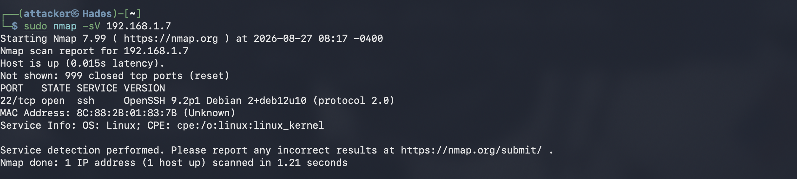
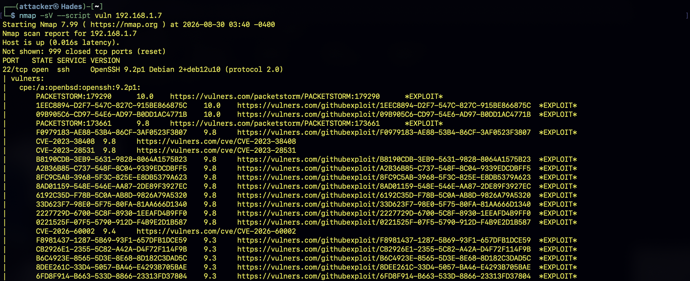
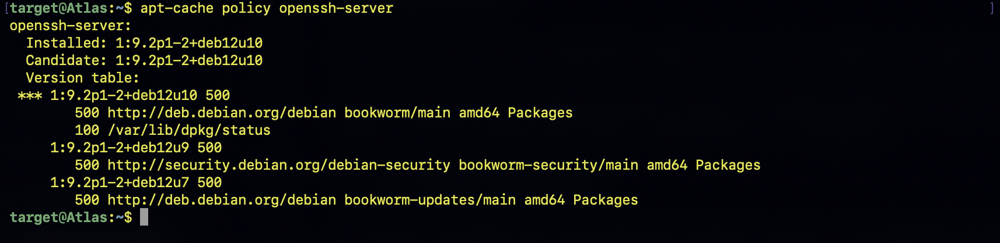
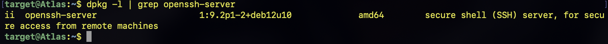

# Phase 4 - Vulnerability Assessment

## Summary

This phase evaluates the services discovered during the network reconnaissance phase and determines whether they contain known vulnerabilities or security weaknesses.

The assessment is performed from **Hades (Kali Linux)** against **Atlas (Debian)**, which serves as the target system in this laboratory environment.

The objective is to identify potential vulnerabilities, validate significant findings, assess their impact, and determine appropriate mitigations.

---

## Objective

- Identify software versions running on exposed services
- Search for known vulnerabilities and security weaknesses
- Validate potentially significant findings
- Assess potential security impact
- Document findings and recommended mitigations

---

## Methodology 

The vulnerability assessment was conducted in several stages:

1. Identify exposed services and software versions.
2. Perform automated vulnerability checks.
3. Review potentially vulnerable services.
4. Research relevant CVEs and security advisories.
5. Validate significant findings where possible.
6. Document the potential impact and recommended mitigation.

The primary tool used during this phase was **Nmap** and its Network Scripting Engine (NSE).

## Implementation

The assessment traffic originates from **Hades** and is directed toward **Atlas**.

Before searching for vulnerabilities, the services running on Atlas were enumerated.

The following command was executed from Hades:

```bash
nmap -sV 192.168.1.7
```
The -sV option enables service and version detection. Rather than only identifying an open port, Nmap attempts to determine the software and version associated with that service.

This information can then be compared against known vulnerabilities and security advisories.

Results

The scan identified the following services:



Port        Protocol        Service
 22            TCP            ssh

## Vulnerability Scanning
Nmap's vulnerability detection scripts were then used to search for potential known vulnerabilities.

The following command was executed:
``` bash
nmap -sV --script vuln 192.168.1.7
```
The --script vuln option instructs Nmap's Network Scripting Engine to run scripts designed to identify potential vulnerabilities and security weaknesses.

The results of automated scanning were treated as potential findings rather than confirmed vulnerabilities. Each significant result requires further investigation and validation

The scan identified the OpenSSH service and returned a number of vulnerability references through the vulnerability-detection scripts.

Several findings were associated with high CVSS scores.

However, the scanner output alone was not considered sufficient evidence that `Atlas` was vulnerable.


## Vulnerability Analysis

The results from the automated scan were reviewed to determine which findings required further investigation.

Automated scanners can produce informational results, version-based matches, and false positives. Therefore, findings were not considered confirmed vulnerabilities without additional validation.

Finding 1 — Potential OpenSSH Vulnerabilities

Affected Host: Atlas

Affected Service: SSH

Port: 22/TCP

Detected Version: OpenSSH 9.2p1 Debian 2+deb12u10

Initial Severity: Multiple high-severity CVSS scores reported by the scanner

Final Assessment: Not confirmed

Description:

The vulnerability scan associated multiple CVEs with the OpenSSH version detected on Atlas.

Several of these findings appeared to have high CVSS scores.

However, automated vulnerability scanners frequently rely on software version information when identifying potential vulnerabilities.

A version match does not necessarily mean that the installed software is vulnerable.

Validation:

The detected OpenSSH package version was investigated further using Debian-specific package information and security advisories.

Debian may backport security fixes into an existing upstream software version without changing the upstream version displayed by the service.

Therefore, the OpenSSH version reported by Nmap cannot be used by itself to determine whether a particular CVE is exploitable on Atlas.

Assessment:

The reported vulnerabilities were therefore treated as potential findings requiring validation rather than confirmed vulnerabilities.

No exploitation was performed based solely on the automated scanner output.

Recommended Action:

Continue monitoring the OpenSSH package for security updates and apply available Debian security updates.

Future vulnerability findings should also be validated against the specific operating system package and vendor security advisories before exploitation is attempted.

## Local Package Verification

To further validate the vulnerability scanner results, the OpenSSH package installed on `Atlas` was examined directly.

The following command was executed on `Atlas`:

```bash
apt-cache policy openssh-server
```


The purpose of this command is to determine the exact Debian package version installed on the system and compare it against the version information reported by Nmap.

The installed package can also be confirmed using:
``` bash
dpkg -l | grep openssh-server
```


This provides package-level information that can be used when investigating whether the CVEs reported by the vulnerability scanner actually apply to the installed Debian package.

## Results

The package information was compared against the vulnerability information identified during the Nmap scan.
Because Debian may backport security patches into an existing package version, the upstream OpenSSH version displayed by Nmap cannot independently establish that the system is vulnerable.

## Findings Summary

The vulnerability scanner identified potential CVE matches associated with the OpenSSH service. However, these findings were not treated as confirmed vulnerabilities because the scanner results alone did not establish exploitability on the specific Debian installation.

## Security Impact

The primary security concern identified during this assessment is the exposure of the SSH service.
SSH provides remote administrative access to Atlas. If improperly configured or vulnerable, an exposed SSH service could potentially allow unauthorized users to gain access to the system.
The risk associated with SSH will therefore be addressed through authentication and configuration controls in subsequent phases.
The assessment also demonstrated that vulnerability severity must be considered together with the actual configuration and software environment of the target.


## Recommended Mitigations

The following mitigations will be considered during the later hardening phase:

- Keep the OpenSSH package updated.
- Monitor Debian security advisories for relevant vulnerabilities.
- Use public key authentication instead of password authentication where appropriate.
- Disable unnecessary authentication methods.
- Restrict SSH access where practical.
- Use firewall rules to limit unnecessary network exposure.
- Monitor authentication logs for suspicious activity.
- Implement additional protections such as Fail2Ban where appropriate.

These mitigations will be implemented and evaluated during the Linux hardening phase rather than during the vulnerability assessment itself.

## Lessons Learned

This phase demonstrated that vulnerability assessment is not simply a matter of running a scanner and accepting its output. The Nmap vulnerability scripts identified several potential CVEs associated with the detected OpenSSH service. However, these results required additional investigation before they could be considered confirmed vulnerabilities. The most important lesson was the distinction between a potential vulnerability and a confirmed vulnerability.

## Phase Conclusion

The vulnerability assessment identified OpenSSH as the primary exposed service on `Atlas`.
Although the automated scanner reported multiple potential CVE matches, the findings were not considered confirmed vulnerabilities without additional evidence demonstrating that the specific Debian installation was affected. The assessment therefore concluded that the primary actionable finding was the exposed SSH service and the need to ensure that it is securely configured and maintained. Further security controls will be implemented during the `Linux Hardening phase`.
