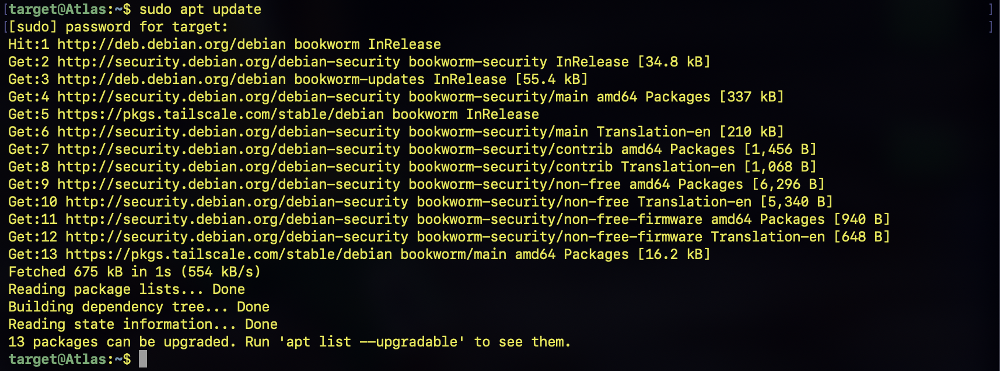
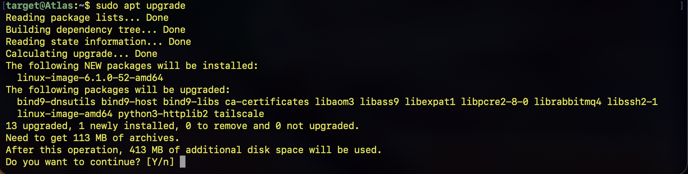
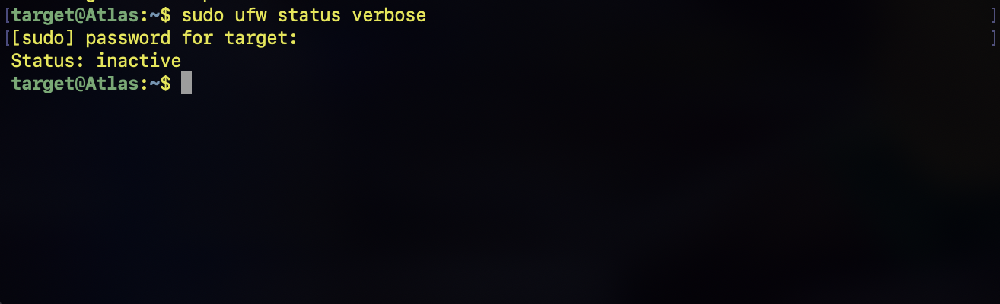
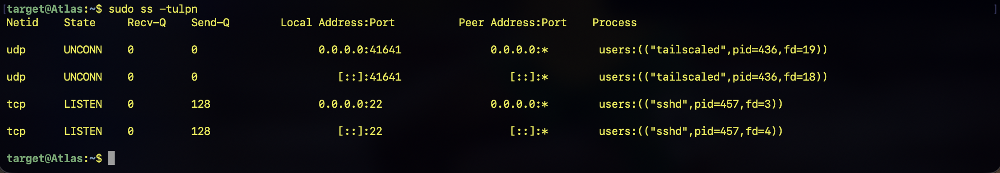

# Phase 5 - Linux Hardening

## Summary

This phase focuses on strengthening the security of `Atlas`, the Debian target server used in the cybersecurity home lab.

Unlike the previous SSH configuration phase, which focused primarily on establishing secure remote access, this phase focuses on reducing the attack surface of the Linux system and implementing additional security controls.

The hardening process follows a **baseline → modification → verification** approach. The existing configuration is first documented, security controls are then applied, and the system is subsequently tested to verify that the changes were successful.

---

## Objective

- Apply security updates and maintain current software
- Review user and privilege configuration
- Harden the SSH service
- Configure a host-based firewall
- Implement brute-force protection
- Identify and minimize unnecessary network services
- Review relevant security logs
- Re-scan the system to verify the effectiveness of the hardening measures

---

## Hardening Methodology

The hardening process will follow these stages:

1. Establish a security baseline.
2. Identify unnecessary exposure and weak configurations.
3. Apply appropriate security controls.
4. Verify that each control was successfully implemented.
5. Re-scan the system from `Hades`.
6. Compare the results against the original baseline.
7. Document the security improvements.


Before making any changes, the current configuration of Atlas was documented.
This provides a reference point for comparing the system before and after hardening.

## Update the System

The package repositories were first updated:
``` bash
sudo apt update
```



`apt update` retrieves the latest package information from the configured Debian repositories.

The available package upgrades were then installed:
``` bash
sudo apt upgrade
```


`apt upgrade` installs available package updates.

Keeping the operating system and installed software updated is an important component of vulnerability management because security updates frequently contain patches for known vulnerabilities.

## Review SSH Configuration

The effective SSH server configuration was examined using:
``` bash
sudo sshd -T
```


`sshd -T` displays the effective configuration used by the OpenSSH server after configuration files and defaults have been processed.
This provides a reliable way to audit the SSH configuration.
The output was reviewed to identify security-relevant settings such as:

Authentication methods,
Root login,
Password authentication,
Public key authentication,
Maximum authentication attempts,
and Protocol configuration.

## Review Firewall Configuration

The current firewall configuration was checked using:
``` bash
sudo ufw status verbose
```



UFW (Uncomplicated Firewall) provides a simplified interface for managing Linux firewall rules.
The command displays whether the firewall is active and shows the currently configured rules.

## Identify Listening Services
The services currently listening for network connections were identified using:
``` bash
sudo ss -tulpn
```


The ss command provides information about network sockets.

The options used here provide information about:

-t — TCP sockets
-u — UDP sockets
-l — Listening sockets
-p — Associated processes
-n — Display numerical addresses and ports

This allows the system's network attack surface to be examined.

## Configure UFW Firewall

The firewall on `Atlas` was initially disabled.

Since SSH is required for remote administration, an SSH rule was added before enabling the firewall:

```bash
sudo ufw allow ssh
```
This allows incoming SSH connections while the firewall is active.

The firewall was then enabled:

```bash
sudo ufw enable
```
The configuration was verified using:

```bash
sudo ufw status verbose
```
## Results


The firewall was successfully enabled with SSH permitted.

** 6. Install Fail2Ban

Fail2Ban was installed to provide additional protection against repeated failed authentication attempts.

The package was installed using:
```bash
sudo apt install fail2ban
```
Fail2Ban was then enabled and started:

```bash
sudo systemctl enable --now fail2ban
```


The service was verified with:

```bash
sudo systemctl status fail2ban
```

## Verification

The final security configuration was verified using the following commands:
```bash
sudo ufw status verbose
sudo fail2ban-client status sshd
sudo ss -tulpn
```
** Lessons Learned

This phase demonstrated how basic host-level security controls can reduce the attack surface of a Linux system.

The primary controls implemented were:

UFW firewall
SSH access restricted through the firewall,Fail2Ban for SSH brute-force protection,Continued monitoring and application of security updates.

These controls provide a basic layer of defense while maintaining the functionality required for remote administration.
