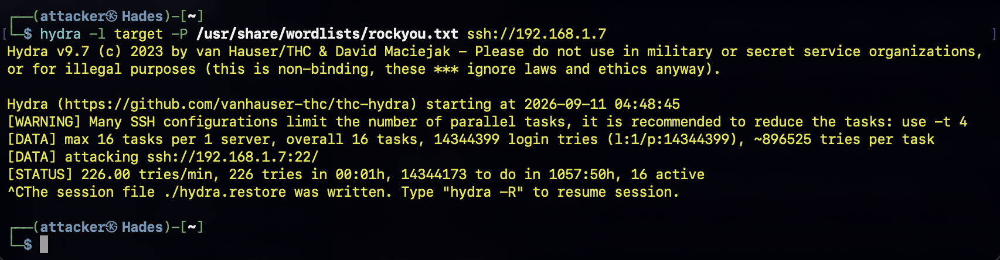
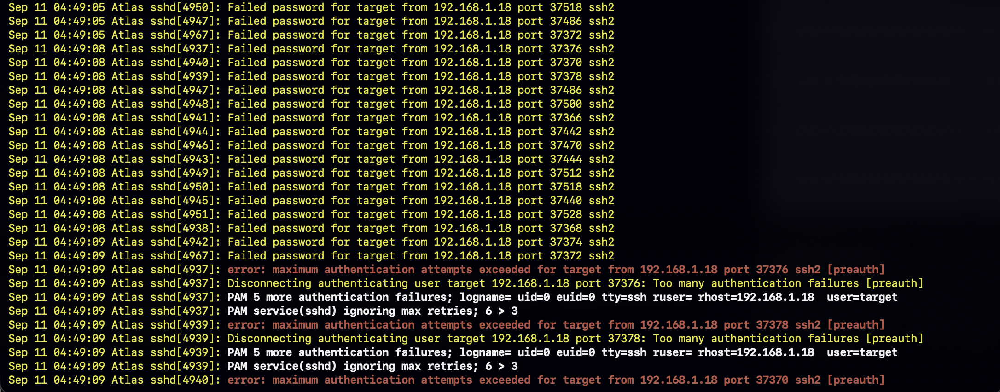
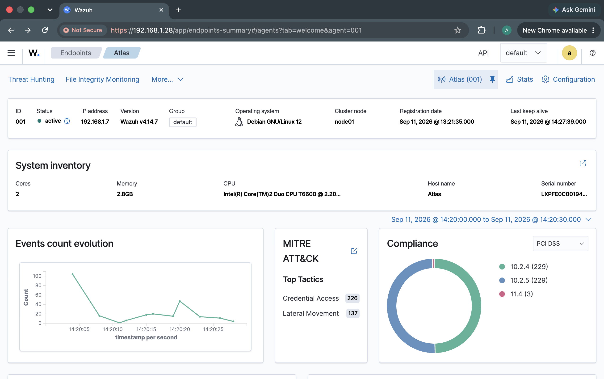
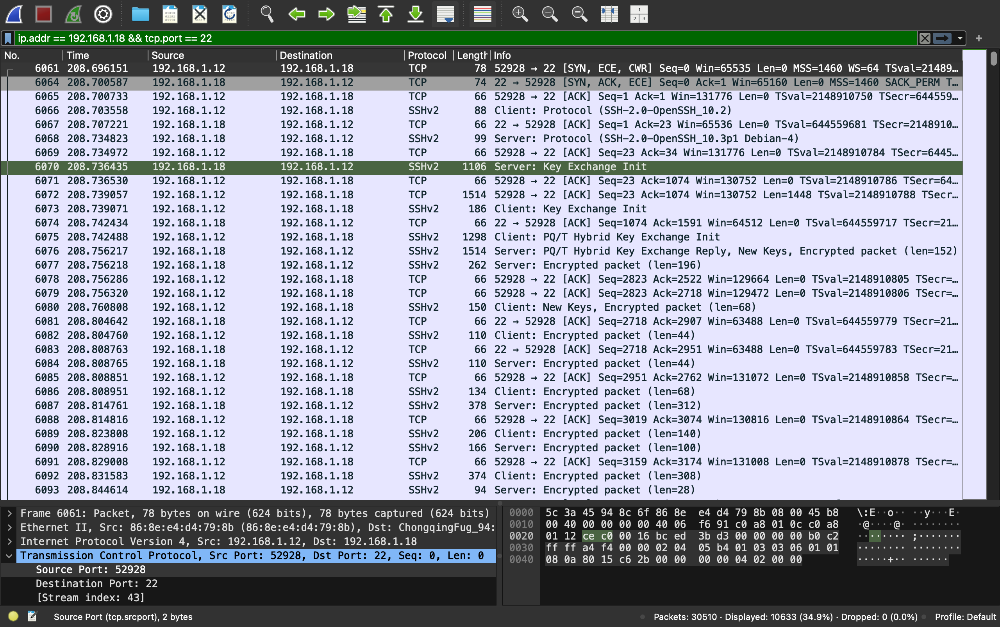

## Overview
In this phase a ssh brute force attack was performed against the Atlas server using the Hades attacker machine. 

The objective of this phase was to simulate a realistic ssh brute force attack that generates authentication failures which could be analyzed later using Wazuh SIEM and Wireshark for network capture. 

This phase consists of the **attack phase** of the lab in which Defensive controls like Fail2Ban were intentionally disabled to observe the effects of the brute force without mitigation.

Devices involved:
 **Hades**  (Attacker)  `192.168.1.18` 
 **Atlas**  (Target)  `192.168.1.7` 
 **Wazuh-Server**  (SIEM / Monitoring)  `192.168.1.28` 

## Objectives

The objectives of this phase were to:

1. Generate a controlled SSH brute-force attack against Atlas.
2. Produce a large number of failed SSH authentication attempts.
3. Capture the resulting activity at the network level using Wireshark.
4. Capture the resulting authentication activity from Atlas's local logs.
5. Provide attack data that could subsequently be analyzed by Wazuh.
6. Establish a baseline for comparison against the later Fail2Ban mitigation phase.

## Attack Preparation

Before beginning the attack, Fail2Ban was disabled on Atlas.
This was intentional. The first attack was designed to establish a baseline without automated blocking.
The Wazuh agent on Atlas was already installed and communicating with the Wazuh server.
The following was verified before launching the attack:

1. Atlas was online.
2. The Wazuh agent was active.
3. Atlas could communicate with the Wazuh server.
4. SSH was accessible on Atlas.
5. Wireshark was prepared to capture the relevant network traffic.

## Attack Tool

The attack was performed using Hydra on Hades.

Hydra is a network login auditing tool capable of testing credentials against supported authentication services. In this lab, it was used specifically to generate repeated SSH authentication attempts against the controlled Atlas server.

The password list used was rockyou.txt, which is available on Kali Linux under:

`/usr/share/wordlists/rockyou.txt`

## Launching the Attack

The following command was executed from Hades:

`hydra -l target -P /usr/share/wordlists/rockyou.txt ssh://192.168.1.7`

The attack therefore attempted multiple passwords against the `target` account on Atlas over SSH before it was stopped using `Ctrl + C` 

Figure 1. Hydra attack from Hades terminal

## Attack Execution

Hydra reported that it was attacking:

`ssh://192.168.1.7:22/`

The initial Hydra output showed:

`[DATA] max 16 tasks per 1 server, overall 16 tasks
[DATA] attacking ssh://192.168.1.7:22/`

Hydra also reported approximately `14,344,399` password candidates in the supplied wordlist.

The attack generated repeated SSH authentication attempts against Atlas.

Hydra reported that the interrupted session could be resumed using its restore mechanism.

## Evidence Collection

The attack was monitored simultaneously from multiple perspectives.

This created three complementary sources of evidence:

### 1. Attacker — Hades

Hydra provided evidence that the authentication attempts were actively being generated. See Launching the Attack for details.

The terminal output documented:

Target IP address
Target service
Target port
Username being tested
Password wordlist
Number of login attempts
Attack rate
Attack duration

### 2. Target — Atlas

Atlas recorded the resulting SSH authentication activity locally.

The Wazuh agent was also running on Atlas during the attack, allowing these authentication events to subsequently be forwarded to the Wazuh server.

Example SSH-related events observed in the Atlas logs included repeated connection and authentication activity originating from the attacker.

Figure 2 — SSH authentication activity recorded on the Atlas target.

### 3. SIEM — Wazuh

The Wazuh agent running on Atlas collected the SSH authentication activity generated during the attack and forwarded the resulting events to the Wazuh server.

The Wazuh dashboard was subsequently used to visualize and correlate the authentication activity. The dashboard showed an increase in SSH-related events and password-guessing activity corresponding to the period during which Hydra was running.

The Wazuh data was not used to initiate or stop the attack. Instead, it provided a centralized view of the events generated on the Atlas server, allowing the attack to be investigated from a defensive monitoring perspective.

Figure 3. Wazuh dashboard showing SSH authentication activity during the brute-force attack.

### 4. Network Capture — Wireshark

Wireshark was used during the attack to capture network traffic for subsequent analysis.

The purpose of the capture was to preserve network-level evidence of the activity generated during the attack. The capture included traffic associated with the lab's SSH connections and other network communication occurring during the experiment.

Because SSH encrypts the contents of the session, the authentication credentials themselves were not visible as plaintext in the packet capture. The packet capture therefore provides information about the network behavior of the attack rather than exposing the passwords being tested.

Figure 4. Wireshark packet capture collected during the SSH brute-force attack.

## Attack Results

The attack successfully generated a large number of SSH authentication attempts against Atlas.

Hydra was intentionally stopped before completing the entire password list. This prevented the experiment from unnecessarily continuing for an extended period while still generating sufficient authentication activity for analysis.

The resulting evidence demonstrated the attack from three different perspectives:

| Attacker | Hydra | Password attempts, target, port, attack rate and duration |
| Target | Atlas SSH logs | Authentication activity generated by the attack |
| Observer | Wazuh | Centralized detection and visualization of SSH-related events |
| Network | Wireshark | Packet-level network activity associated with the experiment |

