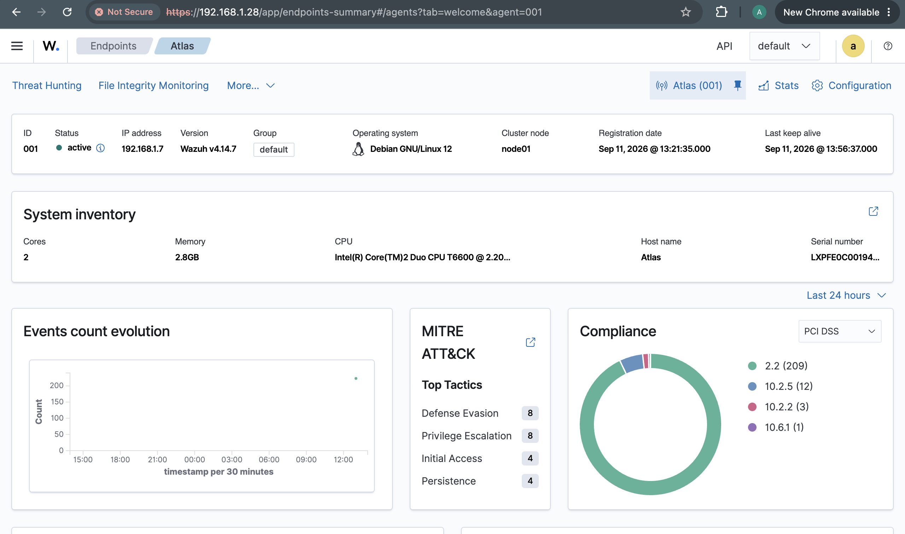
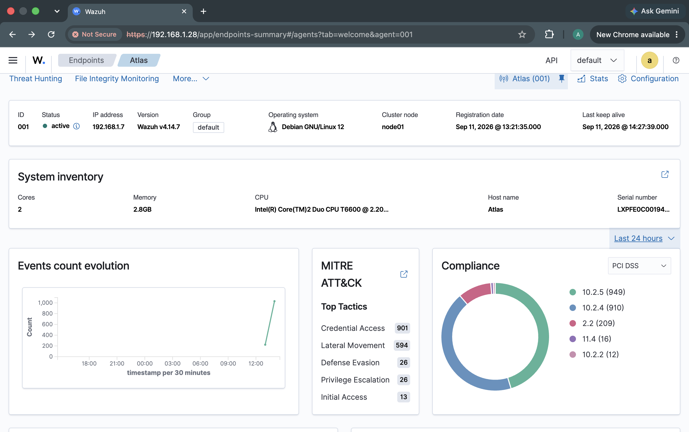
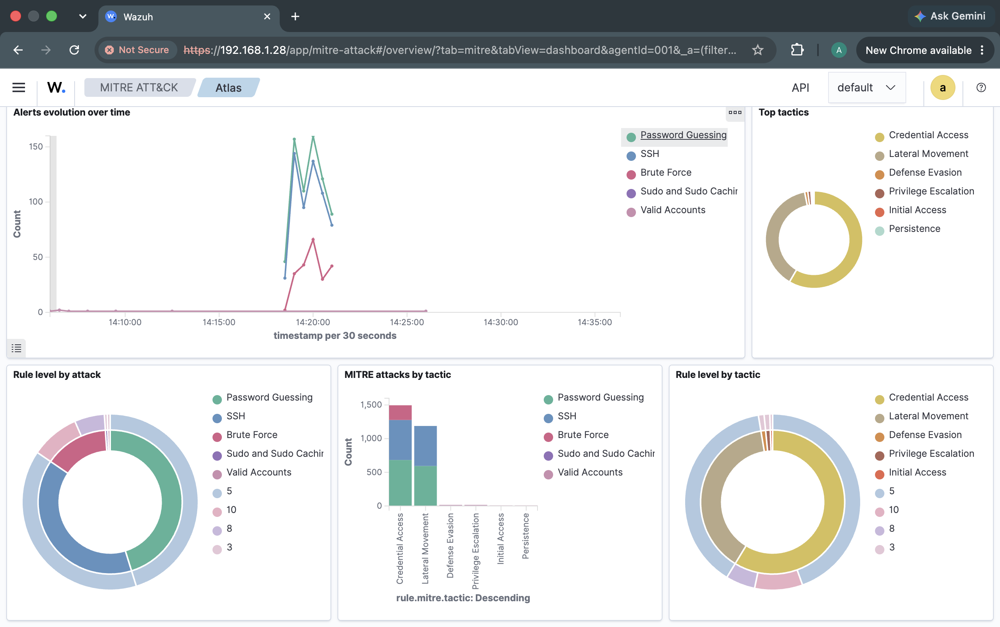
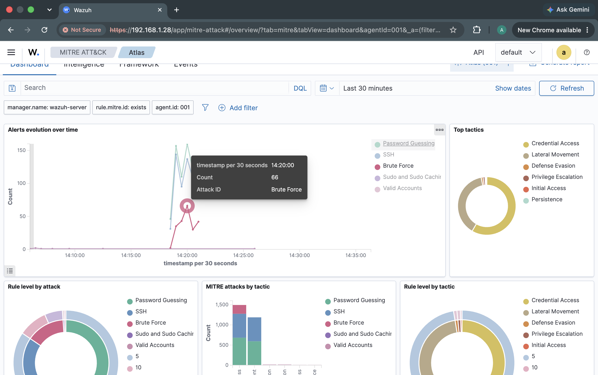

# Phase 7 — SIEM Analysis with Wazuh

## Overview

This phase analyzes the SSH brute-force activity generated during Phase 6 using the Wazuh SIEM environment.

The purpose of this phase was to investigate the attack from a defensive monitoring perspective and compare the state of the Atlas server before and during the attack.

The Wazuh environment consisted of a centralized Wazuh server and a Wazuh agent installed on Atlas. The agent collected security events generated by the Atlas system and forwarded them to the Wazuh server, where they could be analyzed through the Wazuh Dashboard.
This phase does not generate a new attack. Instead, it analyzes the security events produced during the controlled SSH password-guessing attack performed in Phase 6.

Devices involved:

- **Atlas** — Target server `192.168.1.7`
- **Hades** — Attacker `192.168.1.18`
- **Wazuh-Server** — SIEM / Monitoring `192.168.1.28`
- **Odin** — Wazuh Dashboard workstation

---

## Objectives

The objectives of this phase were to:

1. Analyze the SSH brute-force activity generated during Phase 6 using Wazuh.
2. Compare Atlas's baseline security state against its state during the attack.
3. Identify SSH authentication failures and password-guessing activity.
4. Identify evidence of brute-force behavior detected by Wazuh.
5. Demonstrate centralized security monitoring using a SIEM.
6. Establish the security events that will be analyzed at the network level in the following phase.

---

## Wazuh Environment

The Wazuh environment was configured before the attack was performed.

The Wazuh server was hosted on the Ubuntu Server virtual machine running on Odin. Atlas was configured as a Wazuh agent and successfully communicated with the Wazuh server.

The Wazuh agent on Atlas monitored the system and collected relevant security events. These events were forwarded to the Wazuh server, allowing the attack to be viewed centrally rather than relying exclusively on the local Atlas logs.

Baseline State

Before performing the SSH brute-force attack, the Atlas server was captured in a normal operating state.

The baseline screenshots provide a reference point for understanding what the server looked like before malicious activity was introduced.

At this point:

Atlas was online.
SSH was running normally.
The Wazuh agent was active.
No SSH brute-force attack was occurring.
No large spike in SSH authentication activity was present.
Atlas was operating under normal laboratory conditions.

Figure 1. Atlas baseline state before the SSH brute-force attack.

The baseline is important because security monitoring is primarily concerned with identifying deviations from normal system behavior.

Attack Activity Observed by Wazuh

Following the SSH password-guessing attack performed during Phase 6, the Wazuh Dashboard showed a significant increase in SSH-related activity.

The attack generated repeated authentication attempts against the `target` account on Atlas.

The resulting Wazuh data showed a noticeable increase in:

SSH connection attempts
Authentication failures
Password-guessing activity
Brute-force related events

Figure 2. Wazuh dashboard showing credential access related activity during the attack.

The increase in activity contrasted with the relatively quiet baseline observed before the attack.

This provided evidence that the behavior observed on Atlas during the attack was abnormal compared with its normal operating state.

SSH Authentication Activity

The Wazuh dashboard provided a centralized view of the authentication activity generated by the attack.

The graph of SSH attempts closely followed the graph of password-guessing activity. This is consistent with the behavior of the Hydra attack, which repeatedly attempted authentication against the SSH service using different passwords.

Figure 3. Wazuh password-guessing activity during the SSH brute-force attack.

The relationship between these events is significant because the attack was not simply a series of network connections to port 22. The connections resulted in repeated authentication attempts against a specific user account.

This allowed the activity to be characterized as an authentication attack rather than simply general SSH traffic.

Brute-Force Detection

Wazuh also identified activity consistent with SSH brute-force behavior.

The number of events classified as brute-force activity was smaller than the total number of SSH attempts and password-guessing events.

Figure 4. Wazuh detection of SSH brute-force activity.

This distinction is important.

Not every individual failed authentication attempt is necessarily classified as a separate brute-force event. A SIEM can collect individual security events while detection rules identify larger patterns of behavior across those events.

In this case, the individual authentication failures contributed to a larger observable pattern that Wazuh identified as brute-force activity.
The comparison demonstrates why establishing a baseline is important for security monitoring.

A single failed SSH login could potentially represent a legitimate user mistake. However, a large number of authentication attempts occurring in a short period, combined with password-guessing behavior and a consistent external source, provides considerably stronger evidence of a brute-force attack.

## Attack Timeline

The events observed through Wazuh corresponded with the attack performed during Phase 6.

The attack was initiated from Hades:
The temporal relationship between the Hydra attack and the increase in Wazuh events provides additional evidence that the observed activity was generated by the controlled attack rather than normal system behavior.

SIEM Investigation Findings

The Wazuh investigation produced several important findings.

1. The attack generated measurable security events

The SSH password-guessing attack generated authentication activity that was collected by the Wazuh agent running on Atlas.

2. The activity deviated from the baseline

The volume and pattern of authentication activity during the attack differed substantially from the normal baseline.

3. Wazuh provided centralized visibility

Instead of manually examining the Atlas logs, the Wazuh Dashboard provided a centralized interface for viewing and correlating the events.

This is representative of how a SIEM can be used in a SOC environment to monitor multiple systems from a central location.

4. Wazuh identified the broader attack pattern

Individual authentication failures were visible as events, while Wazuh's detection mechanisms could identify the broader pattern as brute-force activity.

Security Significance

The Wazuh investigation demonstrates the difference between log collection and security monitoring.

Atlas's local logs provided raw evidence of what occurred on the server.

Wazuh added another layer by collecting those events centrally and presenting them in a form that made patterns and changes in activity easier to identify.

This is particularly important in larger environments where a security analyst may need to monitor many systems simultaneously.

Conclusion

The Wazuh analysis successfully demonstrated the security impact of the SSH brute-force attack performed in Phase 6.

Compared with the baseline state, Atlas experienced a significant increase in SSH authentication and password-guessing activity during the attack. Wazuh collected these events and provided centralized visibility into the resulting activity.

The investigation also demonstrated that individual authentication events can contribute to the detection of a larger brute-force pattern.

This phase establishes the SIEM perspective of the attack.

The previous phase demonstrated how the attack was generated, while this phase demonstrated how the resulting security events could be detected and investigated centrally.

The next phase will examine the same attack from the network perspective using Wireshark, focusing on the packets and network behavior associated with the SSH activity.
