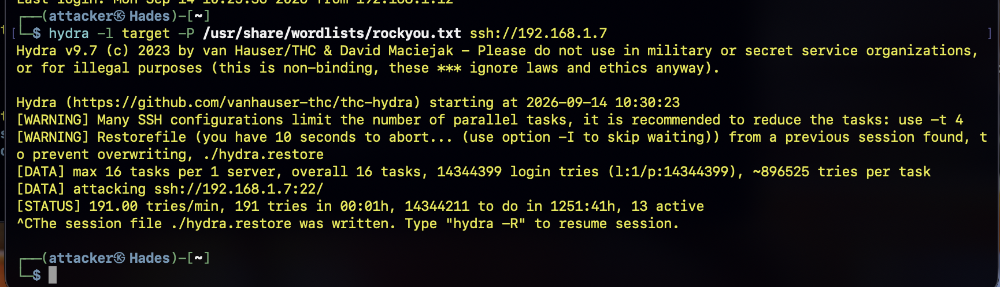
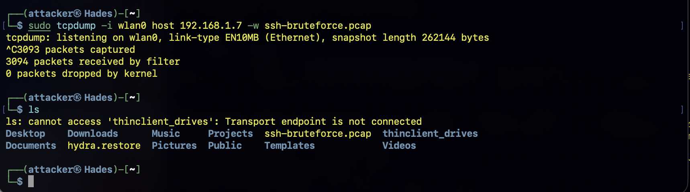
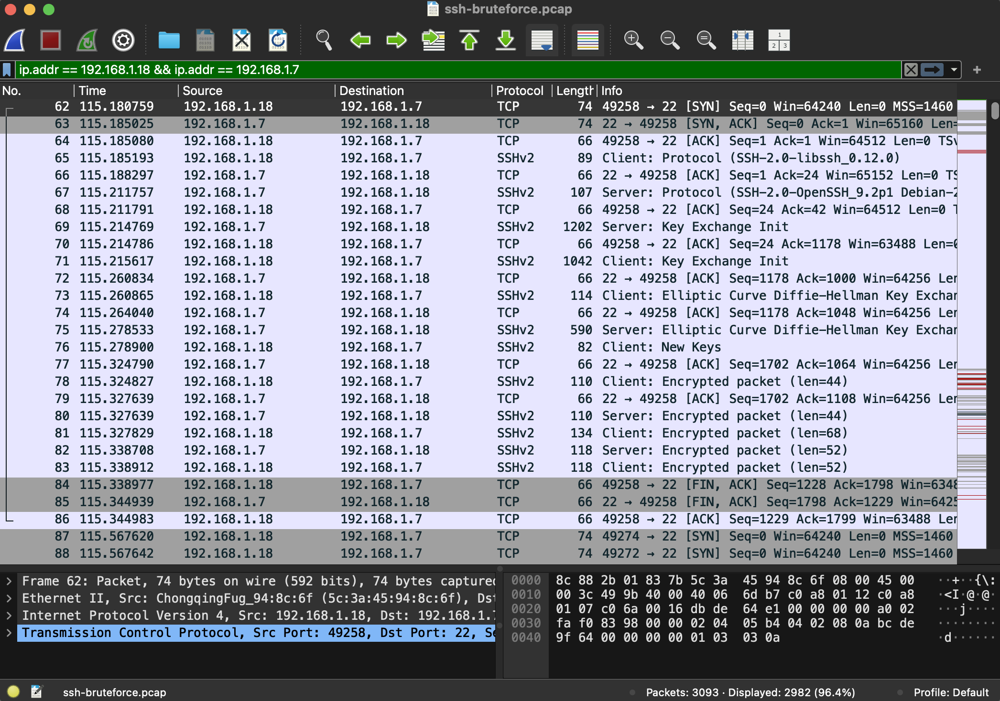
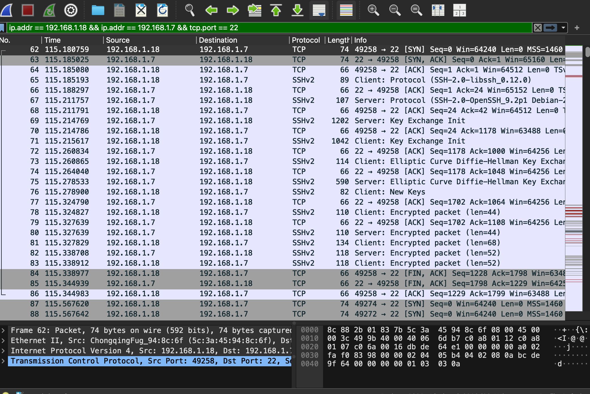

# Phase 8 — Network Traffic Capture and Analysis with Wireshark

## Overview

This phase focuses on capturing and analyzing network traffic generated during an SSH brute-force attack.
The objective is to demonstrate the use of **Wireshark** as a network analysis tool and to examine the network-level characteristics of an SSH brute-force attack.
The attack is performed from **Hades** against **Atlas**, while the network traffic is captured and subsequently analyzed using Wireshark on **Odin**.

Unlike the previous phases, Wazuh is not used for analysis in this phase. The purpose of this phase is specifically to demonstrate network packet capture and analysis using `Wireshark`.

Devices involved:

- **Hades** (Attacker) — `192.168.1.18`
- **Atlas** (Target) — `192.168.1.7`
- **Odin** (Network Analysis Workstation) — `192.168.1.12`

## Objectives

The objectives of this phase were to:

1. Capture network traffic generated by an SSH brute-force attack.
2. Use `tcpdump` to perform command-line packet capture on Hades.
3. Save the captured traffic as a `.pcap` file.
4. Transfer the packet capture from Hades to Odin.
5. Open and analyze the capture using Wireshark.
6. Identify communication between Hades and Atlas.
7. Identify SSH traffic associated with the attack.
8. Examine TCP connection behavior generated by repeated SSH attempts.
9. Demonstrate the limitations of analyzing encrypted SSH traffic.


## Attack Preparation

Before beginning the capture, the following conditions were verified:

- Hades was connected to the lab network.
- Atlas was online and reachable.
- SSH was running on Atlas.
- The attacker could communicate with Atlas.
- Wireshark was available on Odin.

## Packet Capture with tcpdump

The packet capture was started on Hades using:
```bash
sudo tcpdump -i wlan0 host 192.168.1.7 -w ssh-bruteforce.pcap
```
`-w ssh-bruteforce.pcap` writes the captured packets to a PCAP file.

The capture was started before launching the brute-force attack so that the resulting network activity could be recorded.

## Attack Execution
### Launch the SSH Brute-Force Attack

While tcpdump was actively capturing traffic, the SSH brute-force attack was launched from Hades.

The following command was used:

`hydra -l target -P /usr/share/wordlists/rockyou.txt ssh://192.168.1.7`

Hydra generated repeated SSH authentication attempts against Atlas while tcpdump recorded the network traffic.
After sufficient attack traffic had been generated, Hydra was stopped using:
`Ctrl + C`
This stopped the brute-force attack.


### Stop tcpdump
The packet capture was then stopped using:
`Ctrl + C`
This caused tcpdump to close the capture and finalize the PCAP file.
The resulting capture file was:
`ssh-bruteforce.pcap`
The PCAP file contains the packets captured by Hades during the attack.

The following secure copy command was used to copy the .pcap file from Hades to Odin.
```bash
scp hades:~/ssh-bruteforce.pcap ~/
```
### Verify the PCAP File
The capture file was verified using:
`ls -lh ssh-bruteforce.pcap`
This command confirms that the PCAP file exists and displays its size.


## Wireshark Analysis

The transferred ssh-bruteforce.pcap file was opened using Wireshark on Odin.
Wireshark provided a graphical interface for examining the packets captured by tcpdump.
The first Wireshark display filter used was:

`ip.addr == 192.168.1.18 && ip.addr == 192.168.1.7`

This filter displays packets involving both Hades and Atlas.


The addresses represent:

Hades  →  192.168.1.18
Atlas  →  192.168.1.7

The filter helped isolate traffic associated with the attacker and target from other packets that may have been present in the capture.
The attacker and target addresses can also be combined with the SSH port filter:

`ip.addr == 192.168.1.18 && ip.addr == 192.168.1.7 && tcp.port == 22`

This produced a more focused view of SSH communication between Hades and Atlas.



The TCP connections associated with the SSH traffic were examined in Wireshark.
TCP connection establishment uses a three-way handshake:
SYN , ACK and SYN/ACK
Wireshark provided information including:

Source IP address
Destination IP address
Source port
Destination port
TCP flags
Packet length
Sequence numbers
Acknowledgment numbers
TCP stream information

This allowed the SSH traffic to be examined at the packet and transport layers.
Because SSH encrypts its application-layer communication, the credentials being tested by Hydra were not visible as plaintext.
The purpose of this analysis was therefore to examine the network behavior of the SSH connection rather than recover the passwords.

## Limitations

### SSH Encryption

The packet capture does not reveal the plaintext passwords used by Hydra.
This is expected behavior because SSH encrypts the contents of the authentication session.
The packet capture therefore provides information about the communication and its behavior rather than the credentials themselves.

### Capture Location

The capture was performed directly on Hades because Hades generated the attack traffic.
This ensured that the network interface of the attacking machine was used as the capture point.
Capturing from another device on the LAN may not provide the same visibility depending on the network architecture.

## Conclusion

This phase demonstrated the use of tcpdump and Wireshark to perform network-level analysis of an SSH brute-force attack.
The attack was generated by Hydra on Hades. While the attack was running, tcpdump captured the network traffic and saved it as a PCAP file.
The PCAP file was then transferred from Hades to Odin using scp and opened in Wireshark for graphical analysis.
Although SSH encryption prevented the plaintext credentials from being observed, the surrounding network metadata remained available for analysis. This step demonstrated a complete packet analysis workflow.
