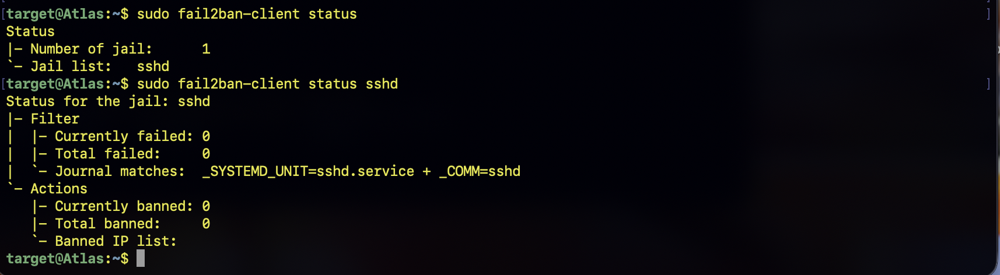
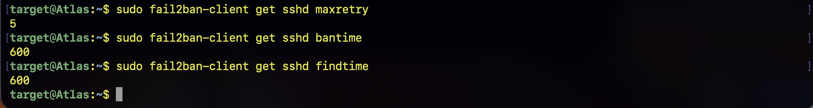
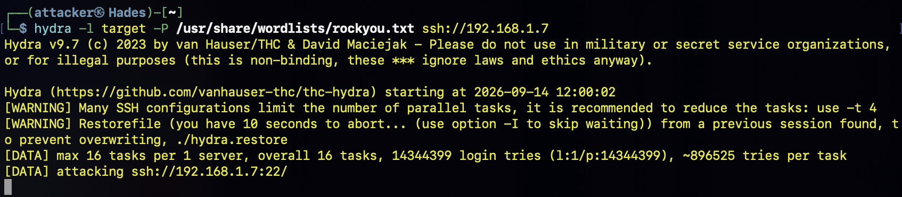
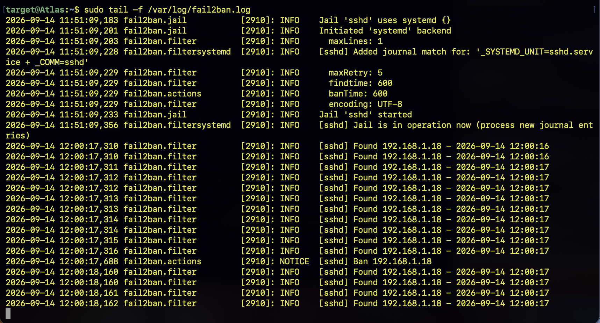
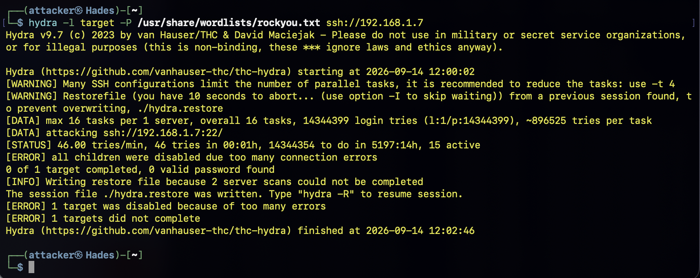
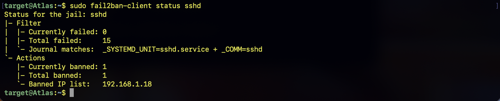
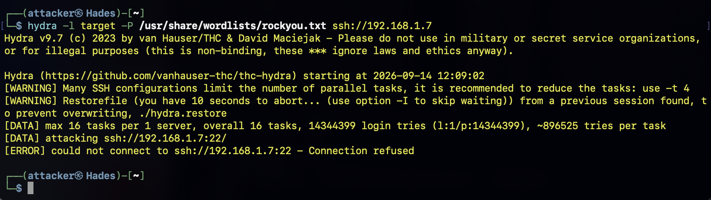

# Phase 9 — Fail2Ban Defense & Mitigation

## Overview

In this phase, the SSH brute-force attack previously performed in Phase 6 was repeated against the Atlas server with **Fail2Ban enabled**.
The purpose of this phase was to demonstrate how an automated defensive control can detect repeated SSH authentication failures and respond by temporarily banning the source IP address.
This phase builds directly upon the baseline established during Phase 6. 
In Phase 6, the SSH brute-force attack was performed while Fail2Ban was disabled, allowing the authentication attempts to continue without automated blocking.
In this phase, the same general attack scenario was repeated with Fail2Ban enabled.
The resulting behavior was then compared against the original unprotected attack.


Devices involved:

- **Hades** (Attacker) — `192.168.1.18`
- **Atlas** (Target / Protected Server) — `192.168.1.7`
- **Wazuh-Server** (SIEM / Monitoring) — `192.168.1.28`

## Objectives

The objectives of this phase were to:

1. Enable and verify Fail2Ban protection on Atlas.
2. Establish a clean baseline before beginning the attack.
3. Repeat the SSH brute-force attack against Atlas using Hydra.
4. Allow Fail2Ban to detect repeated SSH authentication failures.
5. Observe Fail2Ban automatically banning the attacker's IP address.
6. Verify that the attacker could no longer establish an SSH connection after being banned.
7. Examine the resulting authentication and Fail2Ban logs.
8. Compare the protected attack against the unprotected baseline from Phase 6.
9. Demonstrate automated defensive response to an SSH brute-force attack.

---

# Defensive Control

## Fail2Ban

Fail2Ban is an automated intrusion-prevention tool that monitors system logs for repeated signs of malicious activity.
In this lab, Fail2Ban was configured to monitor the SSH service on Atlas.
When repeated failed SSH authentication attempts exceeded the configured threshold, Fail2Ban automatically added the offending IP address to its blocking mechanism.

### Defense Preparation

The Fail2Ban service was checked on Atlas using:

```bash
sudo fail2ban-client status
```
This command displays the currently active Fail2Ban jails.

The SSH-specific jail was then examined using:
```bash
sudo fail2ban-client status sshd
```
This command displays the status of the SSH protection jail, including failed authentication attempts and currently banned IP addresses.



Figure 1. Fail2Ban status before the attack.

### Verify the SSH Jail Configuration

The configured maximum number of failed attempts was checked using:

```bash
sudo fail2ban-client get sshd maxretry
```

This command displays the number of failed authentication attempts allowed before Fail2Ban takes defensive action.
The configured ban duration was checked using:
```bash
sudo fail2ban-client get sshd bantime
```
This command displays how long an offending IP address remains banned.
The time window used for counting failed attempts was checked using:
```bash
sudo fail2ban-client get sshd findtime
```
This command displays the time period within which Fail2Ban counts failed authentication attempts.
These settings determine when Fail2Ban considers repeated SSH failures significant enough to trigger a ban.


Figure 2. Fail2Ban SSH jail configuration.

## Attack Execution

The Fail2Ban log was monitored in real time using:
```bash
sudo tail -f /var/log/fail2ban.log
```
This command continuously displays new entries written to the Fail2Ban log.
The terminal was left running while the attack was performed from Hades.
This allowed the defensive response to be observed as it occurred.

The same general SSH brute-force attack used during Phase 6 was launched from Hades:

```bash
hydra -l target -P /usr/share/wordlists/rockyou.txt ssh://192.168.1.7
```

The command targeted:

Username: target
Target: 192.168.1.7
Service: SSH
Port: 22
Wordlist: /usr/share/wordlists/rockyou.txt
Using the same attack method allowed the results to be compared against the Phase 6 baseline.


Figure 3. Hydra generating SSH authentication attempts against the protected Atlas server.

## Automated Detection and Blocking

### Fail2Ban Detects the Attack

As Hydra generated repeated authentication failures, Fail2Ban analyzed the corresponding SSH authentication activity.
Once the configured threshold was reached, Fail2Ban automatically identified the source IP address as an offending host.
The attacker IP was:

`192.168.1.18`

Fail2Ban then banned the address.


Figure 4. Fail2Ban automatically banning the Hades attacker IP.


Figure 5. Hades attack gets disconnected.

## Verification of the Ban

After the ban occurred, the SSH jail was checked again:
```bash
sudo fail2ban-client status sshd
```
The output showed that the attacker's IP had been added to the banned IP list.

The relevant information included:

`Currently banned: 1
Banned IP list: 192.168.1.18`


Figure 5. Hades listed as a banned IP address.

This provided direct evidence that Fail2Ban had automatically responded to the brute-force attack.

## Verification of Access Blocking

Attempt SSH Access from Hades
After the ban was applied, an SSH connection was attempted from Hades:
```bash
ssh target@192.168.1.7
```
The purpose of this command was to determine whether the defensive control had successfully prevented the attacker from establishing a new SSH connection.
The connection was unsuccessful after the attacker IP had been banned.


Figure 6. SSH connection attempt from Hades after the IP address was banned.

This demonstrated the practical effect of the Fail2Ban defense:an automated response rather than requiring an administrator to manually identify and block the attacker.

The key difference between the two experiments was the presence of the Fail2Ban defensive control.
During Phase 6, the brute-force attack was allowed to continue generating authentication attempts because no automated blocking mechanism was active.
During Phase 9, the repeated authentication failures triggered Fail2Ban, which automatically banned the attacker's IP address.

## Security Impact

The experiment demonstrates the value of automated brute-force mitigation.
Without Fail2Ban, an attacker can continue generating authentication attempts against an exposed SSH service until the attack is manually stopped or another security control intervenes.
With Fail2Ban enabled, repeated authentication failures can trigger an automated response.
This reduces the number of attempts an attacker can make within the period before the ban is applied.
Fail2Ban therefore acts as a defensive layer between the SSH service and repeated automated authentication attempts.
It does not replace strong authentication, SSH hardening, monitoring, or SIEM analysis, but it can reduce the effectiveness of simple automated brute-force attacks.

## Evidence Summary

The following evidence was collected during the experiment:

Fail2Ban service and SSH jail status.
Fail2Ban configuration values.
Clean pre-attack baseline.
Hydra brute-force attack against Atlas.
Fail2Ban log showing the attacker IP being banned.
Fail2Ban status showing 192.168.1.18 in the banned IP list.
Failed SSH connection attempt after the ban.

## Conclusion

This phase demonstrated the implementation and effectiveness of Fail2Ban as an automated defensive control against SSH brute-force attacks.
The same general attack technique used in Phase 6 was repeated against Atlas. However, unlike the original attack, Fail2Ban was active during this experiment.
Repeated SSH authentication failures were detected by Fail2Ban, which automatically identified and banned the source IP address:
`192.168.1.18`
After the ban was applied, subsequent SSH access attempts from Hades were blocked.
The comparison between Phase 6 and Phase 9 demonstrated the difference between an unprotected SSH service and one protected by an automated intrusion-prevention mechanism.
This completes the attack, detection, network analysis, and mitigation workflow for the SSH brute-force scenario.
